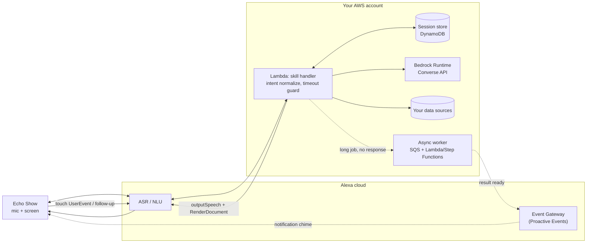

# Calling an LLM or agent from a skill

Putting a model in the voice turn is the part of this stack that breaks people's assumptions.
Everything you know about agent design, tool loops, retrieval-then-generate, streaming tokens
to a UI, assumes you control how long the interaction runs. A skill does not have that luxury.
Read the budget section first, because it eliminates most designs before you write any code.

## The response budget

Amazon's own [Progressive Response docs](https://developer.amazon.com/en-US/docs/alexa/custom-skills/send-the-user-a-progressive-response.html)
state it plainly: "the skill has approximately eight seconds to return a full response." That
is the only documented number in this whole flow, and it is a soft "approximately," not a
published SLA with a hard millisecond boundary. Miss it and Alexa either speaks a generic error
or goes silent, depending on device firmware, and your CloudWatch logs fill with people's
confused retries rather than a clean `SKILL_RESPONSE_TIMEOUT_EXCEPTION`.

The number that actually matters is smaller than eight, because ASR and NLU run before your
Lambda even wakes up. Amazon doesn't publish that pre-invocation latency, so treat the following
table as an engineering estimate, not a spec:

| Stage | Time | Source |
|---|---|---|
| ASR + NLU (speech to intent, cloud-side) | 1-2 s | Estimate, unverified. Not published by Amazon. |
| Lambda cold start (Rust, ARM64, `provided.al2023`) | 50-150 ms cold, ~0 ms warm | Estimate, from Rust cold-start behavior generally; Amazon does not publish per-language cold-start figures. |
| Your data fetch (DB, API, cache) | 50-500 ms | Depends entirely on your backend; budget it explicitly. |
| The model call | 800 ms - 2 s (small model, short prompt) | Estimate; see latency strategies below. |
| Response serialization + directive assembly | <10 ms | Negligible if you're building `serde_json::json!` literals, not templating a large document per request. |
| **Total documented budget** | **~8 s** | [Progressive Response docs](https://developer.amazon.com/en-US/docs/alexa/custom-skills/send-the-user-a-progressive-response.html) |
| **Sum of the rows above** | **~1.9-4.7 s consumed** | Adding the estimate rows together, low end to low end and high end to high end. |
| **Realistic remaining budget for your code + the model call** | **~3.3-6.1 s** | 8 s minus the row above. Treat the low end as your design target; the high end assumes every stage lands at its best case simultaneously, which real traffic rarely does. |


Only the 8-second figure is a documented Amazon number. Every other row is an engineering
estimate based on how these systems generally behave. Measure your own ASR/NLU overhead and cold
start with real CloudWatch traces before you commit a design to a specific number inside that
3.3-6.1 s range.


## Why a naive agent loop doesn't fit

A "naive agent loop," multiple sequential tool calls, a chain-of-thought pass before answering,
a retrieval step followed by a separate generation step, each round-trip to a model or a
downstream system adds latency that is additive, not overlapping. Three tool calls at 1-2
seconds each is 3-6 seconds before you've generated a single word of the answer. A model doing
extended reasoning before it produces output can run 5 to 15+ seconds on its own, with nothing
you control at the network layer.

This is not a problem you tune your way out of. A faster HTTP client, a warmer connection pool,
a better retry policy, none of that changes the fact that the *shape* of a multi-step agent loop
is fundamentally too slow for an 8-second synchronous voice turn. The fix has to change the
architecture: fewer round-trips, less reasoning, or moving the work outside the turn entirely.
Trying to shave milliseconds off a design that needs three sequential model calls is solving the
wrong problem.

## Latency strategies, ranked by how much they actually buy you

Ranked from biggest architectural win to smallest UX polish. Layer several; don't pick one.

| # | Strategy | What it buys | Cost |
|---|---|---|---|
| 1 | Pre-fetch the data, model only phrases it | The single biggest win. Removes an entire I/O round-trip from the model's critical path. | Only works when the intent's slots deterministically tell you what to fetch. Breaks for any skill where deciding what to fetch needs the reasoning you're trying to remove, disambiguating a vague request, following up on "that one" without a stored reference, ranking which of several sources answers the question. Those belong in the out-of-turn pattern below, not this row. |
| 2 | Small/fast model, short prompt, capped output tokens | Gets the model call itself down to roughly 1-2 s instead of 5+ s. | Less capable model means simpler synthesis only, not multi-step reasoning. |
| 3 | Cache the expensive part | Skips the data fetch and sometimes the model call entirely on repeat requests. | Staleness; needs an invalidation story. |
| 4 | Parallelize independent fetches with `tokio::join!` | Turns N sequential I/O calls into one wall-clock max instead of a sum. | Only helps if the fetches are actually independent; doesn't touch the model call itself. |
| 5 | Progressive response directives | Masks 1-3 seconds of remaining latency with filler speech so the wait doesn't feel dead. | **Does not extend the deadline.** It consumes it. Amazon caps you at five progressive responses, each with embedded audio no longer than 30 seconds ([source](https://developer.amazon.com/en-US/docs/alexa/custom-skills/send-the-user-a-progressive-response.html)). |
| 6 | Streaming | Rarely helps here. | See below. |
| 7 | Move the work out of the turn | Sidesteps the deadline entirely. | Real UX cost: the user doesn't get an answer in the same breath they asked. Covered in the next section. |

The model should never be in the data path. If your prompt includes instructions like "look up
the user's order status," you've put retrieval inside the thing you're trying to keep fast. Fetch
the order status yourself, hand the model the number, and ask it only to phrase a sentence around
it. That single change removes more latency than any model swap will, but it only applies when
the intent alone tells you what to fetch. A skill whose job is figuring out what the user actually
wants before you know what to query still needs that reasoning somewhere, it just can't happen
inside the voice turn; see out-of-turn completion below.

**Streaming, honestly assessed.** `converse_stream()` helps a chat UI or a background job
rendering partial output as it arrives. It does not help here: Alexa needs a complete
`outputSpeech` string and a complete datasource before it can speak or render anything, so you
cannot hand it half a sentence and let it catch up. Streaming buys nothing over waiting for the
full `converse()` response and adds a state machine you don't need. Reserve `converse_stream()`
for async jobs, not the voice turn.

## Out-of-turn completion

When the honest answer is "this can't finish in 8 seconds," the right move is to stop pretending
it can. Acknowledge in the turn, do the real work afterward, and tell the user later.

**Proactive Events API.** Per [Amazon's docs](https://developer.amazon.com/en-US/docs/alexa/smapi/proactive-events-api.html),
a skill can POST an event to Alexa's Event Gateway and Alexa surfaces a notification chime to
opted-in customers. Verified constraints, read them before you design around this:

- Opt-in is mandatory per skill; nothing pushes to a user who hasn't enabled **Notifications**
  for your skill in the Alexa app.
- Amazon rate-limits notifications per customer over a rolling 24-hour window and can adjust that
  limit; the exact number isn't published, so don't design around headroom you haven't measured.
- No arbitrary free text. Events must match one of Amazon's predefined schemas
  (`AMAZON.OrderStatus.Updated`, `AMAZON.WeatherAlert.Activated`, and similar), one instance of
  each schema per skill. A result that doesn't map onto an existing schema doesn't fit here;
  there's no "just send this string" escape hatch.
- The documented delivery mechanism is a notification the customer has to ask Alexa to read;
  Amazon's API docs describe the opt-in, the schema, and the rate limit but do not themselves spell
  out chime-versus-screen behavior on a device with a display (unverified as of 2026-07). Nothing
  in the API surface gives a third-party custom skill a way to silently repaint an idle Echo Show.
  That exists for Smart Home Skills reporting device state (`ReportState`/`ChangeReport`), a
  materially different integration with its own certification path, not a substitute for APL.

Practical pattern: acknowledge in the turn ("I'll let you know when your report is ready"), end
the session cleanly, kick the real work to an SQS-fed worker Lambda or Step Functions, and have
that worker POST the Proactive Event when it finishes. This is the honest option for anything
genuinely slow, and it sidesteps the timeout instead of fighting it. See
[alexa-samples/proactive-events-demo](https://github.com/alexa-samples/proactive-events-demo) for
the pattern, useful for the shape of the integration, not for its Node.js version or SDK calls;
Amazon archived the repo in December 2023 and no longer updates it.

## Calling Bedrock from Rust

AWS ships an official `aws-sdk-bedrockruntime` crate (verified on
[docs.rs](https://docs.rs/crate/aws-sdk-bedrockruntime/latest), latest release **1.138.0**,
2026-07-24) as part of the AWS SDK for Rust, and it implements the **Converse API**, Amazon's
model-agnostic request/response shape that works the same way against Claude, Llama, or Titan.
Use `converse()` for the synchronous voice path; there's no reason to reach for
`converse_stream()` here, per the streaming discussion above.

```toml
# Cargo.toml
[dependencies]
aws-config = "1"
aws-sdk-bedrockruntime = "1"
tokio = { version = "1", features = ["macros", "rt-multi-thread", "time"] }
serde = { version = "1", features = ["derive"] }
serde_json = "1"
```

```rust
use aws_sdk_bedrockruntime::{Client, types::{ContentBlock, ConversationRole, Message}};
use std::time::Duration;
use tokio::time::timeout;

// Verified against AWS's model card 2026-07-28: Claude Haiku 4.5, lifecycle "Active".
// Model IDs change as Amazon adds and retires models; re-check yours against the
// Bedrock model catalog (link below) rather than trusting this string long-term.
const MODEL_ID: &str = "anthropic.claude-haiku-4-5-20251001-v1:0"; // region- and account-gated
const MODEL_TIMEOUT: Duration = Duration::from_millis(2_500);

// Build the client once, outside the handler, and reuse it across warm invocations.
// Constructing it per-invocation throws away connection reuse and adds a chunk of the
// cold-start cost this page's budget table already charges you for, on every single call.
async fn call_model(client: &Client, system_prompt: &str, user_text: &str) -> String {
    let request = client
        .converse()
        .model_id(MODEL_ID)
        .system(aws_sdk_bedrockruntime::types::SystemContentBlock::Text(system_prompt.into()))
        .messages(
            Message::builder()
                .role(ConversationRole::User)
                .content(ContentBlock::Text(user_text.into()))
                .build()
                .expect("valid message"),
        )
        .send();

    match timeout(MODEL_TIMEOUT, request).await {
        Ok(Ok(output)) => extract_text(&output).unwrap_or_else(canned_response),
        Ok(Err(e)) => {
            tracing::warn!(error = ?e, "bedrock converse failed");
            canned_response()
        }
        Err(_) => {
            tracing::warn!("bedrock converse exceeded {:?} budget", MODEL_TIMEOUT);
            canned_response()
        }
    }
}

fn canned_response() -> String {
    "I'm having trouble reaching that information right now. Try again in a moment.".into()
}

fn extract_text(output: &aws_sdk_bedrockruntime::operation::converse::ConverseOutput) -> Option<String> {
    output.output()?.as_message().ok()?.content().first()?.as_text().ok().map(String::from)
}
```

The model ID string is region- and account-gated: Bedrock model access is granted per AWS
account per region, and the exact ID format (`anthropic.claude-haiku-4-5-...` versus a
cross-region inference profile ID prefixed `us.`/`eu.`/etc.) shifts as Amazon adds and retires
models, so verify the current ID for your account against the
[Bedrock models at a glance](https://docs.aws.amazon.com/bedrock/latest/userguide/model-cards.html)
page rather than copying one from an old blog post, this page included. Every model card also
states a lifecycle status (Active, Legacy, or Deprecated) and, where applicable, an EOL date;
check both before you ship, not just the ID string.

`tokio::time::timeout` wrapping the call is not optional here: without it, a slow or throttled
Bedrock response consumes your entire remaining budget with nothing to show for it. Degrading to
a canned response is strictly better than letting the Lambda hang until Alexa's own timeout fires
and the user hears silence or a generic error. Construct the `Client` once, before the Lambda
runtime's request loop starts, and pass a reference into the handler on every invocation. Building
it inside the handler recreates the HTTP connection pool and credential resolution on every
request, warm or cold, which works against the cold-start row you already budgeted for above.

Python readers doing the same integration: use `boto3`'s `bedrock-runtime` client and its
[`converse()` method](https://docs.aws.amazon.com/boto3/latest/reference/services/bedrock-runtime/client/converse.html),
paired with the [`ask-sdk-python`](https://github.com/alexa/alexa-skills-kit-sdk-for-python)
request/response handlers for the skill side. The shape is the same: one call, no streaming, a
timeout you enforce yourself (Python's `asyncio.wait_for` around the boto3 call, or a bounded
executor if you're calling synchronously).

Backend plumbing (the Lambda handler shape, the request/response envelope, signature
verification if you're not on Lambda) lives in [Backend in Rust](backend-rust.md).

## Structured output for the dual sink

One model call has to feed two different consumers: text-to-speech, which wants a short natural
sentence, and APL, which wants a strict, typed datasource object. Asking the model for prose and
then trying to parse chart data back out of it is fragile and slow. Ask for both shapes directly
in one structured response instead.

The reliable way to get this from Claude on Bedrock is tool use: define a single tool whose input
schema *is* your response contract, and let the Converse API's `toolConfig` force the model to
call it rather than hoping it emits clean JSON in free text. A minimal contract:

```json
{
  "speech": "Uptime is 94 percent today, with two units flagged for maintenance.",
  "display": {
    "headline": "Status overview",
    "metrics": [
      {"label": "Uptime", "value": "94%", "trend": "up"},
      {"label": "Flagged", "value": 2, "trend": "flat"}
    ]
  }
}
```

Deserialize it into a Rust struct with `serde_json`, don't hand raw model output to your APL
builder:

```rust
#[derive(serde::Deserialize)]
struct AgentResponse {
    speech: String,
    display: DisplayPayload,
}

#[derive(serde::Deserialize)]
struct DisplayPayload {
    headline: String,
    metrics: Vec<Metric>,
}

#[derive(serde::Deserialize)]
struct Metric {
    label: String,
    value: MetricValue,
    trend: Trend,
}

#[derive(serde::Deserialize)]
#[serde(untagged)]
enum MetricValue {
    Text(String),
    Number(f64),
}

#[derive(serde::Deserialize)]
#[serde(rename_all = "lowercase")]
enum Trend {
    Up,
    Down,
    Flat,
}
```

Model output crossing into an APL datasource is a trust boundary, treat it the same way you'd
treat unsanitized user input, not as a formatting detail. `serde_json::from_str::<AgentResponse>`
only proves the JSON has the right shape: right field names, right nesting. It says nothing about
whether the content fits your layout. Two changes narrow that gap instead of just naming it.
First, `trend` as an enum turns an out-of-set value like `"skyrocketing"` into the same
deserialization failure a missing field would be, rather than a string your APL template doesn't
know how to branch on. Second, bound anything with unbounded length yourself after deserializing,
since no `derive` macro does it for you: a `metrics` array the model pads to twenty rows, or a
`label` running to a paragraph, both deserialize cleanly and both break a fixed-slot layout.

```rust
fn fits_layout(r: &AgentResponse) -> bool {
    r.display.metrics.len() <= 6
        && r.display.metrics.iter().all(|m| m.label.len() <= 40)
        && r.display.headline.len() <= 60
}
```

Validate before this reaches an APL datasource, because APL rendering happens on-device and a
malformed or oversized datasource fails silently or renders a broken screen with no server-side
stack trace. Treat a deserialization error and a failed `fits_layout` check the same way: don't
retry the model inside your latency budget, fall straight to a canned `speech` string with no
`RenderDocument` directive. A voice-only degraded answer beats a half-populated screen or a
Lambda panic. The mapping from `speech` to `outputSpeech` and `display` to the APL datasource,
plus the document templates themselves, is covered in [APL displays](apl-displays.md).

## Writing for the ear

A model asked to "answer the question" will happily hand you markdown headers, bullet points,
asterisks for emphasis, and a three-paragraph answer when the user wanted one sentence. TTS reads
`**94%**` as "asterisk asterisk ninety four percent asterisk asterisk" or silently drops the
markup depending on the engine, and long paragraphs feel endless spoken aloud even when they read
fine on a page.

Two mitigations, both required. First, constrain the prompt: no markdown, no lists, one or two
short sentences, plain language a person would say out loud, and a low `max_tokens` cap so a
runaway response can't happen even if the model ignores the instruction. Second, sanitize before
it becomes speech, because the constraint won't hold every time: strip markdown syntax (`*`, `#`,
`` ` ``), collapse whitespace, truncate to a sentence count, before wrapping the result in
`outputSpeech`. Alexa supports SSML (`<speak>`, `<break time="300ms"/>`, `<emphasis>`) for pacing
if you want more than flat text, but SSML you generate from a template is far more reliable than
trusting a model to emit valid SSML on request.

This is why the structured-output contract splits `speech` from `display`: the spoken field
stays short and sanitized, the display field carries full detail without ever being read aloud.
Don't reuse one string for both.

## The drill-in loop

A touch on an APL component or a spoken follow-up ("what about last week") is a new request to
your Lambda, not a continuation of the same invocation. Both arrive as fresh events: a touch
fires `Alexa.Presentation.APL.UserEvent`, a spoken follow-up arrives as an ordinary
`IntentRequest` with the session kept open (`shouldEndSession: false`). Each one gets its own
8-second clock.

The question that matters for latency: does this follow-up need a new model call at all? If the
user is only navigating data already on screen, expanding a row, tapping a metric they already
saw, that's a UI state change, not a new question, and re-running the model wastes budget and
money. Handle pure navigation with `Alexa.Presentation.APL.ExecuteCommands` directives that
mutate the existing document client-side: no model call, no new datasource. Reserve a fresh model
call for requests that need new synthesis: a different time range, a different entity, a
genuinely new question.

Split state by lifetime: **`sessionAttributes`** for small, ephemeral context, "what's on screen
right now," the identifiers needed to interpret a bare follow-up like "what about that one," gone
when the session ends and fine with that, since it only needs to survive one conversation.
**DynamoDB** (or another store) for anything that needs to survive past the session: conversation
history longer than a turn or two, user preferences, or state a Proactive Event worker needs to
read after the voice turn already ended. Session attributes round-trip through Alexa on every
request and count against your response payload size, so don't put anything large or long-lived
there.

## Cost and quota reality

Two billing dimensions stack on every model-calling turn: Lambda charges per invocation and per
1 ms of execution, at a lower per-GB-second rate on Graviton/ARM64 than x86, per the
[Lambda pricing page](https://aws.amazon.com/lambda/pricing/); Bedrock charges per request and
per token, input and output priced separately and varying by model, per the
[Bedrock pricing page](https://aws.amazon.com/bedrock/pricing/). Neither page renders cleanly
through automated fetching as of this writing, so treat "per-token, per-request, model-dependent"
as the verified shape and pull exact figures from the page yourself before budgeting a production
workload.

The quota failure mode that matters more than price in a latency-critical path: Bedrock throttles.
Per the [Bedrock quotas documentation](https://docs.aws.amazon.com/bedrock/latest/userguide/quotas.html),
on-demand inference is governed by per-model, per-region requests-per-minute and tokens-per-minute
quotas, and exceeding either returns a `ThrottlingException` (HTTP 429) on the Converse API. A 429
in your 8-second window is an immediate failure with no data to phrase, not a slow response, and
it will happen under real traffic if you haven't checked your quota against expected concurrency.
The `tokio::time::timeout` wrapper above degrades on this case too, since a 429 returns fast and
lands in the `Ok(Err(e))` branch. Frequent throttling in production is a quota-increase request,
not a retry loop; an 8-second budget rarely has room for a second attempt.

## Alexa+ in 2026: what changes for a new project

Amazon's rearchitecture around Alexa+, its generative-AI-powered assistant, added integration
surfaces alongside, not instead of, classic custom skills. Amazon's original
[February 2025 developer announcement](https://developer.amazon.com/en-US/blogs/alexa/alexa-skills-kit/2025/02/new-alexa-announce-blog)
named three SDKs for this: an Action SDK, a Web Action SDK, and a Multi-Agent SDK. That naming is
announcement-era and has since changed. As of July 2026, Amazon's
[Alexa+ for Builders](https://developer.amazon.com/alexaplus/) page names a different lineup: a
**Category SDK** (reservations, food ordering, home services, booking, ticketing, ride booking),
an **MCP Toolkit** (wiring in an existing MCP server with minimal changes), and a **smart-home AI
toolkit** for device manufacturers. Neither current page mentions the Feb 2025 names at all, so
treat those three original names as historical, not as something you can go build against today.

More importantly, the page states plainly that access is gated: "Alexa+ for Builders is currently
available to select partners working directly with our team." This isn't a program a new project
can sign up for and start using; it's an invitation-only track run directly with Amazon.

Verified: ASK-based custom skills keep working in 2026, and Amazon isn't forcing a migration. Not
fully verified: how much of this page becomes unnecessary for a project that does get a partner
invitation and whose use case is a plain task-completion flow the Category SDK already covers end
to end. For everyone else, and for the "answer a question and show a screen using your own data
and your own model" shape this page is for, none of that changes anything: that's still a custom
skill with a Lambda backend calling Bedrock yourself, because the Alexa+ toolkits target task
execution against partner APIs or existing MCP servers, not a general voice+screen app built on a
data source you own, and you cannot currently opt into them without going through Amazon's partner
process. Confirm current toolkit names and eligibility against the
[Alexa+ for Builders](https://developer.amazon.com/alexaplus/) page before committing a new
project's direction, since this area moves faster than the rest of the platform.

## Reference architecture



The top loop is the synchronous 8-second path: the only place your `tokio::time::timeout` guard
matters. The dotted branch is explicitly outside that budget, and it reports back through a
notification, not a held-open request. See [Interaction model](interaction-model.md) for how
intents and slots feed the normalize step, and [APL displays](apl-displays.md) for what happens
after the structured response comes back.

## Sources

- [Send the User a Progressive Response](https://developer.amazon.com/en-US/docs/alexa/custom-skills/send-the-user-a-progressive-response.html), Amazon (8-second budget, progressive response limits)
- [About the Proactive Events API](https://developer.amazon.com/en-US/docs/alexa/smapi/proactive-events-api.html), Amazon
- [alexa-samples/proactive-events-demo](https://github.com/alexa-samples/proactive-events-demo), Amazon (archived December 2023, pattern reference only)
- [aws-sdk-bedrockruntime, docs.rs](https://docs.rs/crate/aws-sdk-bedrockruntime/latest), version 1.138.0 verified 2026-07
- [Amazon Bedrock models at a glance](https://docs.aws.amazon.com/bedrock/latest/userguide/model-cards.html), AWS (model IDs and lifecycle status, verified 2026-07-28)
- [Quotas for Amazon Bedrock](https://docs.aws.amazon.com/bedrock/latest/userguide/quotas.html), AWS
- [AWS Lambda pricing](https://aws.amazon.com/lambda/pricing/), AWS
- [Amazon Bedrock pricing](https://aws.amazon.com/bedrock/pricing/), AWS
- [boto3 bedrock-runtime `converse`](https://docs.aws.amazon.com/boto3/latest/reference/services/bedrock-runtime/client/converse.html), AWS
- [alexa/alexa-skills-kit-sdk-for-python](https://github.com/alexa/alexa-skills-kit-sdk-for-python), Amazon
- [Introducing AI-native SDKs for Alexa+](https://developer.amazon.com/en-US/blogs/alexa/alexa-skills-kit/2025/02/new-alexa-announce-blog), Amazon developer blog, February 2025 (announcement-era SDK naming, superseded)
- [Alexa+ for Builders](https://developer.amazon.com/alexaplus/), Amazon, verified 2026-07-28
